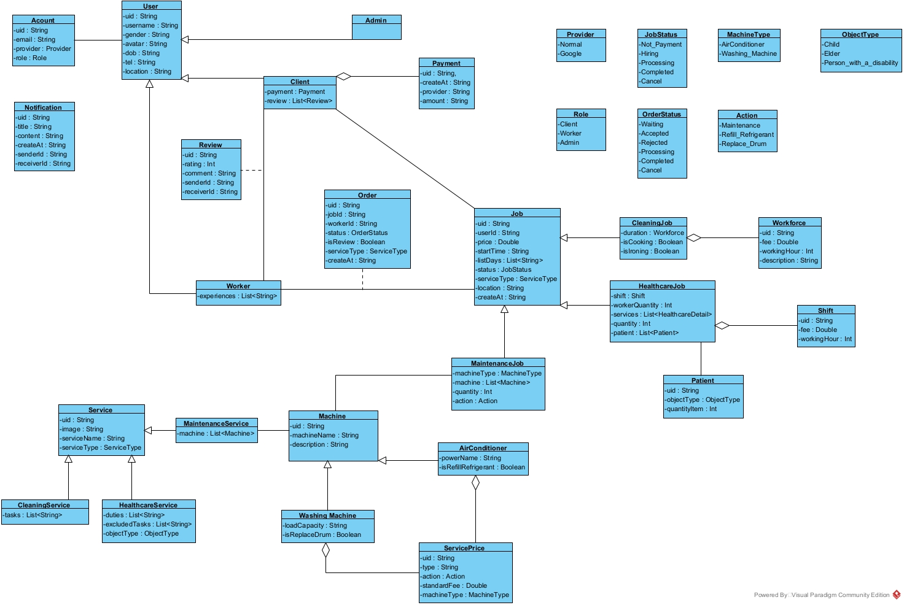
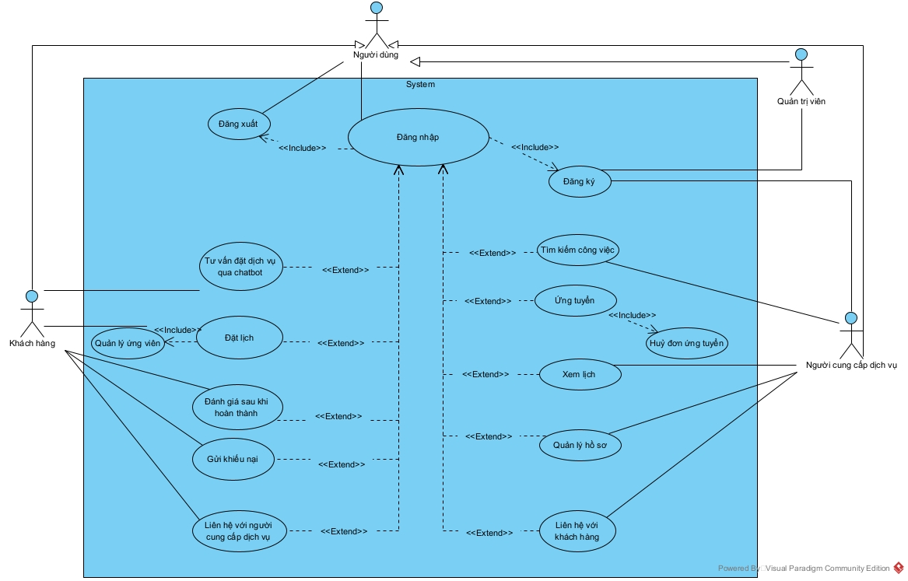

# 🧰 HELPO – Ứng dụng dành cho Người cung cấp dịch vụ (Worker)

## 🏗️ Giới thiệu hệ thống

**HELPO** là ứng dụng trung gian giúp kết nối **người có nhu cầu dịch vụ (Khách hàng)** với **người cung cấp dịch vụ (Nhân viên)** thông qua nền tảng trực tuyến, hướng đến sự **minh bạch, tiện lợi và hiệu quả** trong quy trình làm việc.

Ứng dụng được phát triển với mục tiêu:

* 🔹 Tạo nền tảng uy tín giúp kết nối nhanh chóng giữa **Khách hàng** và **Người cung cấp dịch vụ**.
* 🔹 Tối ưu hoá quá trình **đăng tuyển – ứng tuyển – đánh giá dịch vụ**.
* 🔹 Cung cấp trải nghiệm **đơn giản, rõ ràng, dễ thao tác** cho cả ba đối tượng: **Quản trị viên**, **Người cung cấp dịch vụ**, và **Khách hàng**.

---

## 👥**Người cung cấp dịch vụ (Worker)** được cung cấp các chức năng

* Đăng ký tài khoản: Đăng ký qua Admin hệ thống
* Đăng nhập bằng Email | Password
* Xem danh sách công việc
* Ứng tuyển công việc và chờ duyệt
* Có thể huỷ ứng tuyển
* Nhận việc - Khi được chấp nhận, công việc sẽ được hiển thị trong "Lịch làm việc"
* Xem đánh giá từ khách hàng 
* Quản lý lịch làm việc: Lọc các công việc theo ngày cụ thể
* Chat Realtime với khách hàng

---

## 🧩 Kiến trúc hệ thống

Ứng dụng được xây dựng theo mô hình **MVVM Architecture** kết hợp **Repository Pattern**, đảm bảo tách biệt rõ ràng giữa:

* **UI (Compose)** – giao diện hiện đại, dễ mở rộng.
* **ViewModel** – quản lý trạng thái, luồng dữ liệu bất đồng bộ.
* **Repository** – xử lý truy xuất dữ liệu từ **Firebase**, **API (Remote)** hoặc **(Local)** khi không có mạng.

### 📘 Biểu đồ hệ thống

* **Biểu đồ lớp (Class Diagram)**: mô tả chi tiết mối quan hệ giữa các thực thể như *User, Job, Order, Review, Notification…*

* **Biểu đồ Use Case**: thể hiện các chức năng chính của hệ thống đối với từng vai trò *(Client, Worker, Admin)*.

---

## ⚙️ Công nghệ sử dụng

| Thành phần      | Công nghệ                                        |
| --------------- | ------------------------------------------------ |
| Ngôn ngữ        | **Kotlin**                                       |
| UI Framework    | **Jetpack Compose**                              |
| Kiến trúc       | **MVVM + Repository Pattern**                    |
| CSDL & Realtime | **Firebase Firestore, Realtime Database (RTDB)** |
| Thông báo       | **Firebase Cloud Messaging (FCM)**               |
| Bản đồ          | **Google Map API**                               |
| Điều hướng      | **Navigation Component (Compose Navigation)**    |
| Luồng dữ liệu   | **Kotlin Flow, Coroutine**                       |

---

## 📱 Tính năng chính (Worker App)

* 🔍 **Tìm kiếm công việc** theo loại dịch vụ.
* 📩 **Ứng tuyển – Huỷ ứng tuyển – Nhận việc.**
* 🔔 **Thông báo realtime (FCM)** khi có cập nhật đơn việc hoặc đánh giá.
* 📊 **Xem điểm đánh giá và phản hồi khách hàng.**
* 🗓️ **Quản lý lịch làm việc theo ngày/tuần.**
* 🧭 **Tích hợp bản đồ định vị.**

---

## 🧠 Hướng phát triển tương lai

* Tích hợp **đề xuất việc làm thông minh** dựa trên kinh nghiệm và vị trí.
* Hỗ trợ đa ngôn ngữ (Việt/Anh).
* Thay đổi UI Mode (Light Mode/ Dark Mode)

---
## Demo
| Feature | Preview |
|----------|----------|
| 🕹️ App Flow | [[App Flow]](https://drive.google.com/drive/folders/1MSOnLEOGi1m5Wr_ivLKaBJUWsTaZX7X-?usp=sharing) |
